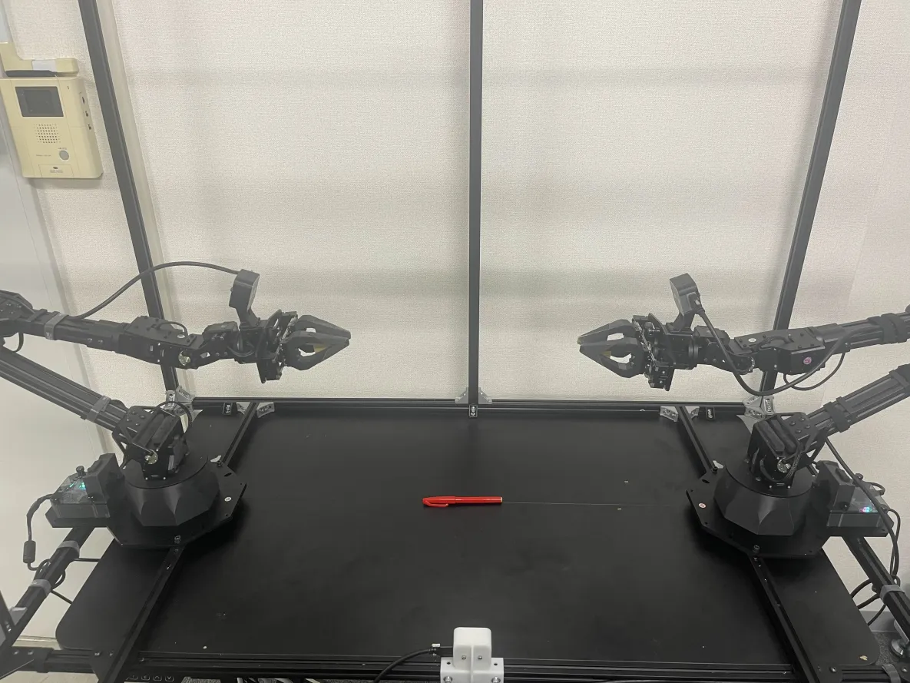

# Openpi-RTC

This repository implements [**Real-Time Action Chunking (RTC)**](https://www.physicalintelligence.company/download/real_time_chunking.pdf) for the [openpi](https://github.com/Physical-Intelligence/openpi) framework, with comprehensive testing on the ALOHA robot platform using the `pi0_aloha_pen_uncap` model. Our experimental results demonstrate performance improvements: **RTC reduces task completion time from 10 seconds to 9 seconds** for the pen uncapping task. As shown in our [demonstration video](./medias/uncap.mov), when the robotic arm approaches the pen, the RTC-enabled model exhibits notably faster response times compared to the baseline implementation without RTC.

Our implementation includes two key components:

- **Action Chunk Broker** (`packages/openpi-client/src/openpi_client/action_chunk_broker.py`): Calculates action chunks based on the robot's current state
- **Guided Inference** (`src/openpi/models/pi0.py`): Implements a `guided_inference` function that computes action chunks based on previous actions

## Installation

When cloning this repo, make sure to update submodules:

```bash
git clone --recurse-submodules https://github.com/EII-Tokyo/openpi-rtc.git

# Or if you already cloned the repo:
git submodule update --init --recursive
```

We use docker to run the code.

- Docker must be installed in [rootless mode](https://docs.docker.com/engine/security/rootless/)
- Install [nvidia-container-toolkit](https://docs.nvidia.com/datacenter/cloud-native/container-toolkit/latest/install-guide.html)

### Arm Symlink Setup
We will configure udev rules for the arms such that they are bound to the following device names:
- ttyDXL_master_left
- ttyDXL_master_right
- ttyDXL_puppet_left
- ttyDXL_puppet_right

To set these up, do the following:

1. Plug in only the leader left robot to the computer.

2. Determine its device name by checking the `/dev` directory before and after plugging the device in. This is likely something like `/dev/ttyUSB0`.

3. Print out the device serial number by running the following command:
```bash
udevadm info --name=/dev/ttyUSB0 --attribute-walk | grep ATTRS{serial} | head -n 1 | cut -d '"' -f2
```

4. The output of the command will look like `FT88YWBJ` and be the serial number of the arm’s U2D2 serial converter.

5. Add the following line to the computer’s fixed Interbotix udev rules at `/etc/udev/rules.d/99-fixed-interbotix-udev.rules`:

```bash
SUBSYSTEM=="tty", ATTRS{serial}=="<SERIAL NUMBER>", ENV{ID_MM_DEVICE_IGNORE}="1", ATTR{device/latency_timer}="1", SYMLINK+="ttyDXL_master_left"
#                                 ^^^^^^^^^^^^^^^ The result from the previous step
```

6. Repeat for the rest of the arms.

7. To update and refresh the rules, run the following command:

```bash
sudo udevadm control --reload && sudo udevadm trigger
```

8. Plug all arms back into the computer and verify that you can see all devices:

```bash
ls -l /dev/ttyDXL*
```

### Camera Setup

- Modify the `third_party/aloha/aloha_scripts/realsense_publisher.py` file to use serial numbers for your cameras.

## Run the uncap task

make sure the scene is like this:


```bash
docker compose -f examples/aloha_real/compose.yml up
```

## Training on your own Aloha dataset

1. Convert the dataset to the LeRobot dataset v2.0 format. 
    
    We provide a script [convert_aloha_data_to_lerobot.py](./examples/aloha_real/convert_aloha_data_to_lerobot.py) that converts the dataset to the LeRobot dataset v2.0 format. As an example we have converted the `aloha_pen_uncap_diverse_raw` dataset from the [BiPlay repo](https://huggingface.co/datasets/oier-mees/BiPlay/tree/main/aloha_pen_uncap_diverse_raw) and uploaded it to the HuggingFace Hub as [physical-intelligence/aloha_pen_uncap_diverse](https://huggingface.co/datasets/physical-intelligence/aloha_pen_uncap_diverse). 


2. Define a training config that uses the custom dataset. 

    We provide the [pi0_aloha_pen_uncap config](../../src/openpi/training/config.py) as an example. You should refer to the root [README](../../README.md) for how to run training with the new config.
 
IMPORTANT: Our base checkpoint includes normalization stats from various common robot configurations. When fine-tuning a base checkpoint with a custom dataset from one of these configurations, we recommend using the corresponding normalization stats provided in the base checkpoint. In the example, this is done by specifying the trossen asset_id and a path to the pretrained checkpoint’s asset directory within the AssetsConfig.